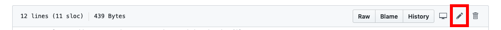
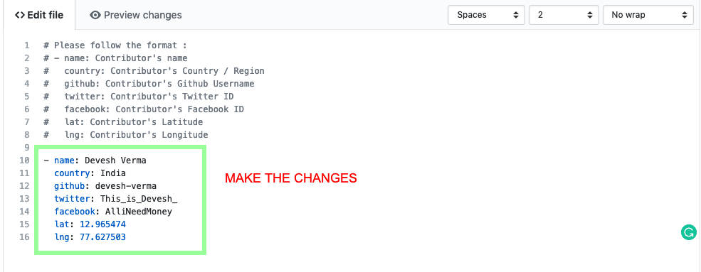
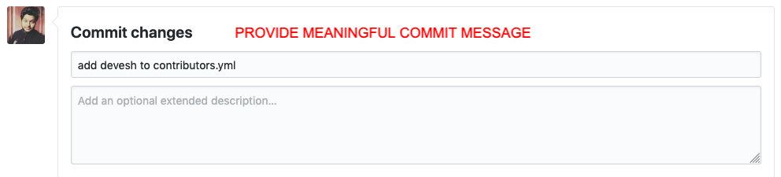
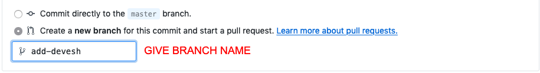
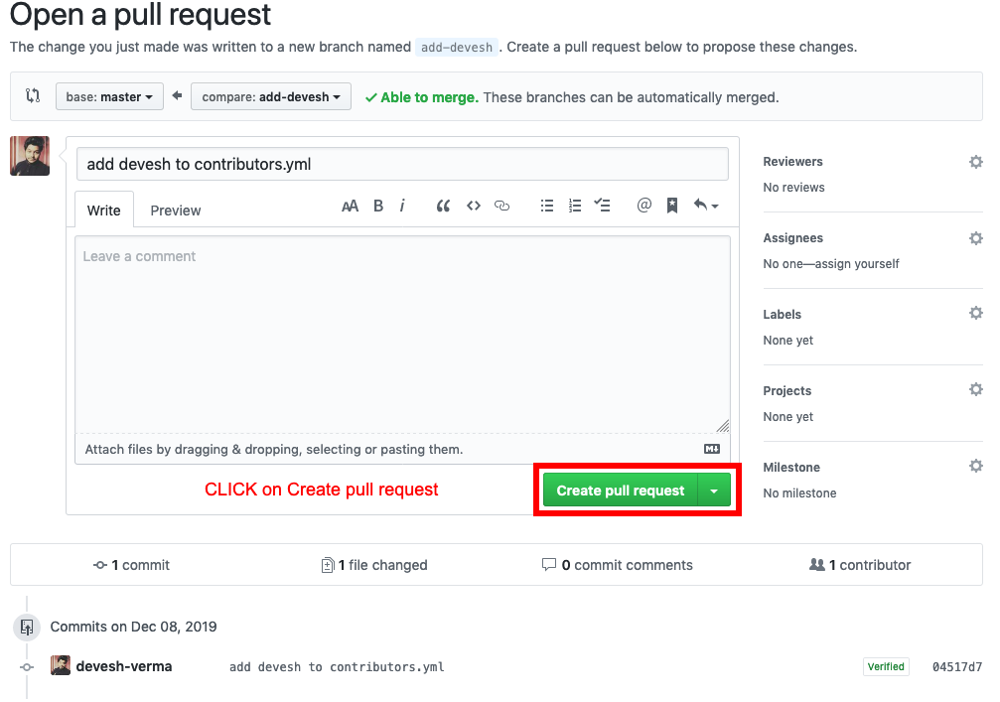
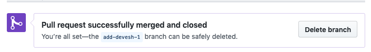

* The purpose of this repo is to help you awesome GCI contributors get familiar with the github workflow and how it works.
* Excited to move forward?? Please follow along.

## How to Contribute?
- Add yourself to [contributors.yml](./_data/contributors) in the format specified.
- Join our channel on [slack](http://slack.codeuino.org/).
- DONE!!

## Steps to make your first contributon:

- Step 1: Navigate to contirbutor.yml by clicking [here](./_data/contributors).

- Step 2: Click on the edit button.

- Step 3: Make the changes the by following the format mentioned at the very starting of the file.

- Step 4: Give a meaningful commit message.

- Step 5: Make a new branch to send your chages, so that you are not directly sending your changes to branch `master`.

- Step 6: Now click on `propose changes`.

🎉🎉 We are almost done. Now we need to send these changes by sending a Pull Reqest to `master branch`.

- Step 7: `Step 6` will take you to a new page to make this last change.You need to hit the `Create pull request` button to raise a Pull Request. 

- Step 8: DONE!!😎 Now sit back and relaxx 🛌. Wait for you Pull Request to get merged.

#### VOILA!! YOU HAVE MADE YOUR FIRST CONTRIBUTION TO CodeUino 🎉🎉.

## Our Awesome Contributors ✨

Thanks goes to these wonderful people ([emoji key](https://allcontributors.org/docs/en/emoji-key)):

<!-- ALL-CONTRIBUTORS-LIST:START - Do not remove or modify this section -->
<!-- prettier-ignore-start -->
<!-- markdownlint-disable -->
<table>
  <tr>
    <td align="center"><a href="https://github.com/devesh-verma"> <b>Devesh Verma</b></a> <a href="https://github.com/codeuino/gci/commits?author=devesh-verma" title="Code">💻</a></td>
  </tr>
</table>

<!-- markdownlint-enable -->
<!-- prettier-ignore-end -->
<!-- ALL-CONTRIBUTORS-LIST:END -->

This project follows the [all-contributors](https://github.com/all-contributors/all-contributors) specification. Contributions of any kind welcome!
